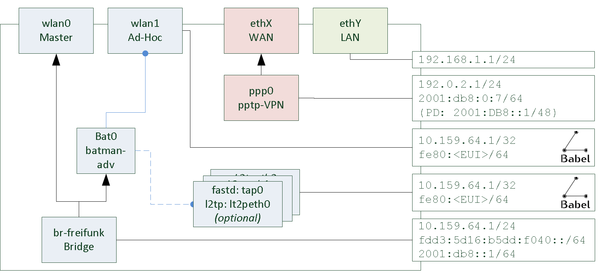
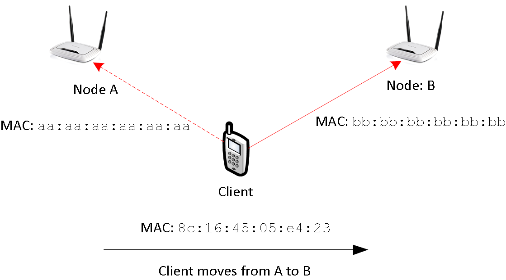
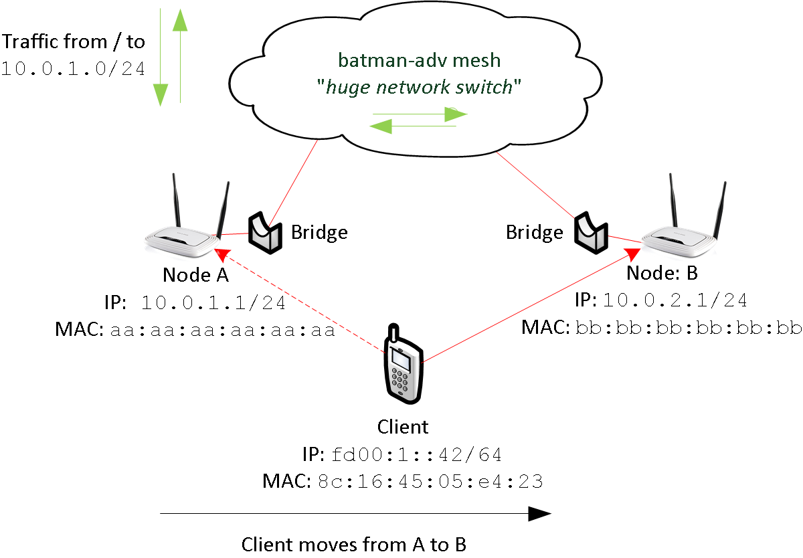
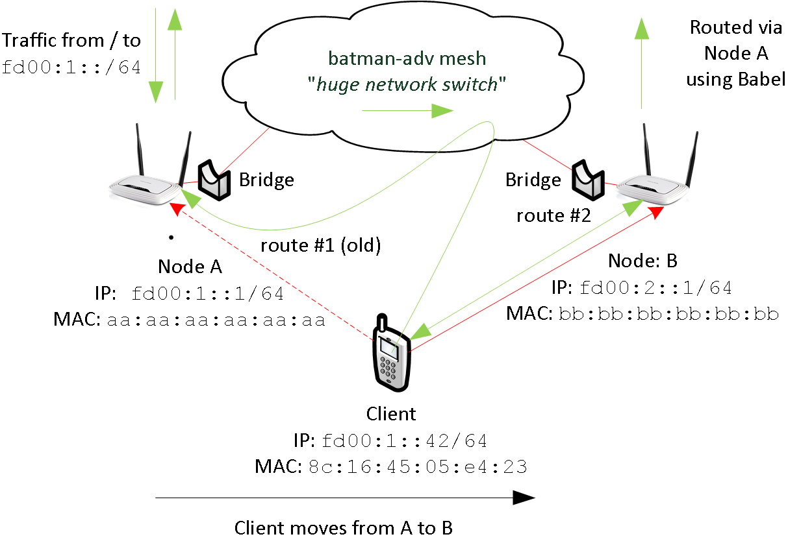
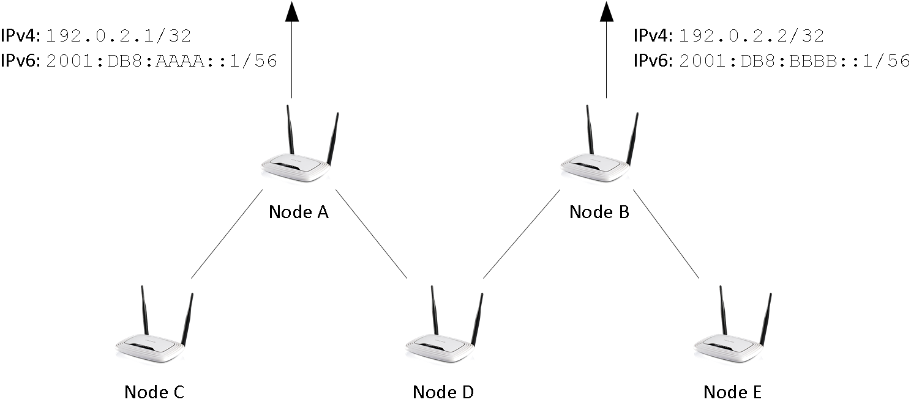

= Node-Config Documentation
:doctype: book
:appendix-caption: Appx
:sectnums:
:toc: right
:source-highlighter: coderay

= Introduction & Quick-start
Most of us are into free wireless mesh networks. We're fascinated by the idea of
deploying a bunch of OpenWRT routers, that magically connect to each other
to span large mesh cloud.

Unfortunately, doing so is very hard - the various different options for mesh routing protocols
and network designs can be overwhelming.

Many community networks deploy complex configurations. They release
custom firmware blobs using self-written scripts to customize OpenWRT images.
Usually, these firmware blobs are tight to a specific network by including network addresses or wifi identifiers.

Some Freifunk firmware files even include vpn-server-addresses, rendering them useless for other communities or
people living just a few kilometers away.

Here, configuration becomes opaque and thus hard to understand: It's buried in binary images using custom
software and different, sometimes hackish startup-scripts.

Build systems such as Gluon provide a heavy-weight abstraction to OpenWRT.
By creating a Domain-Specific-Language (DSL), all relevant OpenWRT settings are duplicated into a site-model,
which is then used to describe a specific community network. Although not having explicit restrictions,
this site-model focuses on backend-server driven networks, somewhat missing the point of a wifi mesh network.
Very little changes to the configuration require a build using the full OpenWRT buildroot.

Node-config is trying to jump in here by providing a comprehensible configuration.
Without having a shiny user interface in its core, node-config is focusing on network enthusiasts.
It explains all necessary OpenWRT settings for a simple wifi mesh, while providing complete and easy-to-use setup.

== What node-config is

Node-config is just a _bunch of uci configuration files including a scripts to apply them_. It is copied to
plain OpenWRT routers running Lede 17.01 and merged into the existing configuration. It configures routing, network- and wireless interfaces as
well as network services such as dhcp and radv.

It spans a mesh network using _both babel and batman-adv_ to provide roaming and
hierarchical routing capabilities. The network is IPv4 and IPv6 dual-stack.

[NOTE]
====
.You can use and understand node-config as:
- An elaborate example for an OpenWRT mesh configuration
- A kickstarter or template for wifi mesh networks without a central vpn (i.e. servers)
- A way for building supernodish nodes in gluon based Freifunk networks to get rid of servers
- A lean baseline for testing new architectures and services (i.e. l3roamd)
====

A git-repository is availble at  https://github.com/node-config -
for help and discussions please subscribe to the
https://lists.freifunk.net/mailman/listinfo/wlanware-freifunk.net[wlanware mailing list].

== Quick-start

You need https://downloads.openwrt.org[OpenWRT / LEDE 17.01] installed on a router and enough free flash space (~2 MB).
The router has to be connected to the internet (wan port) an to your computer (pc or laptop using the lan port)

It helps to be familiar with a unix terminal (i.e. Mac OS, Linux)
since you need to use ssh to connect to your router. In addition, git is required:

.On your computer execute:

[#src-listing]
[source,bash]
----
git clone https://github.com/yanosz/node-config.git
cd node-config; scp -r freifunk root@192.168.1.1:/lib
ssh root@192.168.1.1 /lib/freifunk/install.sh
----

It is assumed, that your router is reachable at `192.168.1.1` (OpenWRT default). Using `git`, `scp` and `ssh`
node-config is cloned and then copied to your router. It is applied using <<_install_sh>>.

[WARNING]
====
1. _Set a password_ - your router will be reachble using ssh.
2. When executing `/lib/freifunk/install.sh` you are asked for one IPv4 (/24) and one IPv6 (/64) network.
These networks are distributed using dhcp and radv and _have to be unique_.
You _must not share a subnet among routers_. Using distinct RFC1918 ranges and IPv6 unique local addresses (ULA)
is usually the way to go. Please mind bookkeeping.
====

== Using packages

Package can be used _instead of copying the filesystem tree_ using git and scp.

For testing, opkg packages are available at: https://kbu.freifunk.net/files/node-config/. Packages are built
using the projects <<_makefiles>> and Gitlab CI server.

.To install the packages open a ssh session to your router and execute:

[#src-listing]
[source,bash]
----
wget -O /etc/opkg/keys/cca6643a8ac2f277 http://opkg.kbu.freifunk.net/node-config/cca6643a8ac2f277
echo "src/gz nc http://opkg.kbu.freifunk.net/node-config/packages" >> /etc/opkg/customfeeds.conf
opkg update
opkg install node-config node-config-openvpn node-config-pptp
----
_Reboot the router_, after installing the packages.
For setting IPv4 and IPv6 networks open a new ssh session execute `/lib/freifunk/set_ip.sh`.
When executing `opkg install node-config`, core components are installed, only - openvpn and pptp are not available.

[CAUTION]
====
1. Set a password - your router will be reachable using ssh
2. Make sure, that `/etc/opkg/keys/cca6643a8ac2f277` matches the key available at
https://kbu.freifunk.net/files/node-config/cca6643a8ac2f277 - the download _is not using TLS_.
3. The public key for `cca6643a8ac2f277` is availble in our Gitlab CI and may be easily become compromised.
Consider using you own key when using packages. For details see <<_makefiles>>.
====

== Internet Sharing

=== Direct Exit
To share the routers WAN uplink in the mesh cloud, you have to enable it.

.Open a ssh session to your router and execute:

[#src-listing]
[source,bash]
----
uci set network.internet_share.disabled=0
uci set network.internet_share6.disabled=0
uci firewall.freifunk_internet.dest='wan'
uci commit firewall
uci commet network
/etc/init.d/firewall restart
/etc/init.d/network restart
----

NOTE: By enabling `internet_share` and `internet_share6`, WAN routes will be copied to the
mesh routing table. `uci firewall.freifunk_internet.dest='wan'` enables forwarding.

=== Using a VPN provider
To use a vpn tunnel (i.e. mullvad),
you can use a configuration in `/lib/freifunk/vpn` and activate it by editing `/etc/config/openvpn`.
See <<__etc_config_openvpn>> for details.

TIP: If you want to use a provider not included in
`/lib/freifunk/vpn`, you can place your provider's configuration there.
Mind adding `route-nopull`, `script-security 2` and `up /lib/freifunk/vpn/up.sh` for default route handling.
Have a look at existing VPN configurations for example. Also mind setting `dev vpn-nat` to use
the correct network interface.

== Git directory structure

All configuration can be found in `/freifunk/initial_configuration`. Other directories contain scripts,
build files and documentation.

|===
|Path |Contents
|`/`
| Directory root, including readme's, the project's Makefile and CI-configuration
|`/doc`
| Documentation including the asciidoc source of this manual
|`/freifunk`
| Configuration including scripts
|`/freifunk/initial_configuration`
| OpenWRT configuration (uci)
|`/freifunk/lib`
| Shared routines for scripts
|`/freifunk/vpn`
| OpenVPN exit configuration for different providers
|`/lede_built/node-config`
| Makefiles and other files for creating OpenWRT packages
|===

= Configuration in node-config

The configuration is documented on a per-file basis - Each OpenWRT configuration is explained individually.

Figure 1 shows the system from a birds eye perspective.

.Interface configuration - bird's eye perspective

Node-config creates a hand full of interfaces: wlan0, wlan1, bat0, br-freifunk
as well as vpn interfaces like tap0 and ppp0. They are configured as follows:

.External interfaces (switch ports, radio)
* _wlan0_ and _wlan1_ are set up by node-config
** wlan0 is running in master mode. It's used by all clients.
** wlan1 is running in ad-hoc (or 802.11s) mode. This interface is used for meshing.
* _ethX (WAN)_ and _ethY (LAN)_ are created by OpenWRT. They are not configured by node-config.
** The LAN interface is used for a management (SSH / LuCI).
** The WAN interface connects to the internet. It can be used for internet sharing.
** Optionally, a VPN (openvpn, pptp, wiregard) can tunnel internet traffic.

.Internal interfaces (bridges, vpn)
* _bat0_ is the batman-adv interface of the system. It utilizes the ad-hoc interface for meshing.
* _br-freifunk_ is central: It bridges all clients (wlan0) into the roaming domain (wlan1).
* Other vpn interfaces (_fastd: tap0, l2tp: l2tpeth0_) are optional: They created and
 assigned to batman-adv and / or babel to mesh and roam using wires or directed wireless links.

Some interfaces are used by services to provide connectivity:

.Miscellous interfaces (not shown)
* _DHCP_ and _radv_ services are running on br-freifunk. They hand out ip-addresses to clients.
However, these dropped on bat0 using ebtables to reduce broadcast / multicast traffic.
* _babel_ is running on the wlan1 interface and all vpn interfaces used for mesh routing.

WARNING: Mind not to bind the optional vpn interfaces to br-freifunk / bat0.
It is easy to have a catch-22.

Some interfaces are missing in the picture - have a look at the actual system:

.Additional interfaces
* Most interfaces have an IPv6 counterpart. These duplicates are needed by OpenWRT
* `internet_share` is a duplicate of the  WAN interfaces.
It's used for copying WAN routes into the freifunk routing tables.
* By default, node-config creates two optional interfaces using fastd. One is for
Routing within Freifunk communities (_enabled_), while the other is part of the
Freifunk / Gluon supernode template (_disabled_)

== /etc/config/wireless

The wireless configuration is generated using a shell script
Additional information in wireless
configuration can be found in the OpenWRT wiki. the https://openwrt.org/docs/guide-user/network/wifi/basic[OpenWRT wiki].

WARNING: The regulatory region is set to `DE` (Germany).
Please adjust if needed

.Content of `wireless.sh`
[#src-listing]
[source,bash]
----
include::../freifunk/initial_configuration/wireless.sh[]
----

.Three things are done by `wireless.sh`:

1. It detects how many radios are available
* If there's a radio, 2.4 Ghz is assumed. It's locked to channel 1 and enabled
* If there's a second radio, 5 Ghz is assumed. It's locked to channel 36 and enabled.
* Other radios are ignored
2. If unused OpenWRT default configurations are present on a radio, they are disabled.
3. An ad-hoc interface with SSID `42:42:42:42:42:42` and an access point interface with SSID `Freifunk`
is created on all radios detected before. All ad-hoc interfaces use a broadcast rate of 12 MBit/s. While the 5 Ghz radio is using 40 Mhz,
the 2.4 GHz has 20 MHz.

=== Naming the Service Set ID (SSID):

You can adjust the BSSID and SSID according to your needs. Creating separated networks
requires using different SSIDs. For roaming, all SSID of a network must be the same:

On the one hand, moving to an accesspoint with a different SSID will reinitialize the wifi card -
all active connections will be lost. On the other hand, all mesh stations need the same SSID to connect to each other. The network
will fall apart, if they differ.

Keep in mind, that the _Extended Service Set ID_ (ESSID) is called _SSID_ in OpenWRT.
It is the network name shown on clients. The _Basic Service Set ID (BSSID)_ defines the technical identifier
of the ad-hoc segment. By its design, ad-hoc networks can fall apart by mistakenly generating different BSSIDs
for the same logical segment. Thus the BSSID needs set to fixed value. The issue is addressed by IEEE 802.11s.

For more details on service sets have a look at
https://en.wikipedia.org/wiki/Service_set_(802.11_network)[wikipedia].

=== Using IEEE 802.11s

You can use the new IEEE 802.11s mesh mode instead of the new ad-hoc. To do so, you need to modify
`wireless.sh`.

.Modication to `wireless.sh` - example for radio0 (first radio, 2.4 Ghz usually).
[#src-listing]
[source,bash]
----
# ...
        set wireless.wifi_mesh='wifi-iface'
        set wireless.wifi_mesh.device='radio0'
        set wireless.wifi_mesh.network='mesh babel_mesh'
        set wireless.wifi_mesh.mode='mesh'
        set wireless.wifi_mesh.mesh_id='42:42:42:42:42:42'
        set wireless.wifi_mesh_fwding='0'
        set wireless.wifi_mesh.mcast_rate='12000'
# ...
----

When modifying the 5 Ghz network, use `wifi_mesh5` instead of `wifi_mesh`.

Setting `mesh_fwding='0'` disables forwarding in the IEEE 802.11s mesh network.
Forwarding _is disabled_, because  Babel and batman-adv need to see the topology on their own.
Forwarding would hide the structure of network from both babel and batman-adv.
In addition, it is redundant to batman-adv.

[TIP]
====
.If experimenting with IEEE 802.11s mesh forwarding:
1. Disable batman-adv - directly attach the mesh interfaces to the Freifunk bridge
2. Try to make babeld using the overlay metric
3. Avoid re-transmitting babel messages - IEEE 802.11s will distribute them anyway.
3. Happy hacking :-).
====

== /etc/config/batman-adv
https://www.open-mesh.org/projects/batman-adv/wiki[Batman-adv] is used for roaming.
It uses all wifi ad-hoc interface (2.4 Ghz and 5 Ghz). In addition, VPN (l2tp, fastd)
interfaces can be added to improving roaming when no radio contact is available.

The configuration does not contain any network interfaces. The mapping is done in
`/etc/config/network`. More details configuration options are listed in the
https://www.open-mesh.org/projects/batman-adv/wiki/Batman-adv-openwrt-config[Open-Mesh wiki].

.`batman-adv.uci` creates a mesh (`bat0`) using these options.
[#src-listing]
[source,bash]
----
include::../freifunk/initial_configuration/batman-adv.uci[]
----

Having hardly any mobility in a Freifunk-style network, an originator interval of 5 seconds
is enough. Bridge loop avoidance, the distributed arp table
and ogm aggregation is enabled.

Fragmentation is enabled for roaming using wired interfaces. Usually, ethernet, l2tp or fastd
connections cannot transmit a complete batman-adv frame
using up to 1532 bytes without fragmentation.

== /etc/config/network

The network configuration is probably the most complex part of node-config.
Be brave, you'll make it :-).

Have a look at the https://openwrt.org/docs/guide-user/base-system/basic-networking
for additional help on OpenWRT's network configuration.

=== Network Interfaces
Let's look at the network interfaces first (cf. `network.ci`).

.These network interfaces are created in `/etc/config/network`

[#src-listing]
[source,uci]
----
include::../freifunk/initial_configuration/network.uci[tags=interfaces]
----

That is it :-). Try matching these interfaces with bird's eye perspective picture in the
beginning (Figure 1).

NOTE: You might need to adjust some interfaces according to your local
setup (i.e. `internet_share` - use `proto 'static'` instead of `proto 'dhcp'`). All vpn and fastd interfaces can be removed, if vpn connections are not in use.

=== Routes & Rules

Node-config uses a dedicated routing table (66). This allows separating the mesh
from uplink and management networks. To build this table, all relevant IPv4 and IPv6 routes
are duplicated. In addition, IP rules assign mesh traffic to this table.

Have a look at the https://www.tldp.org/HOWTO/Adv-Routing-HOWTO/[Linux Advanced Routing & Traffic Control HOWTO]
for more information on policy based routing.

.Routes and Rules in `network.uci`

[#src-listing]
[source,uci]
----
include::../freifunk/initial_configuration/network.uci[tags=routes]
----

Unfortunately, OpenWRT cannot create all rules using `/etc/config/network`. Thus
they're created using the firewall script `/etc/firewall.user`. Being part of node-config
`rules.sh` modies the the firewall script. `|| true` prevents `firewall.user` from failing, if
an interface is not available, yet.

[NOTE]
====
* When adding new interfaces to babel (i.e. l2tp connections), new
rules have to be added accordingly.
* The firewall is reload, when new interfaces become available.
====

.Rules added by `firewall.user`

[#src-listing]
[source,uci]
----
include::../freifunk/initial_configuration/rules.sh[]
----

=== PPtP configuration

`network_pptp.uci` has additional interfaces for PPtP. Due to this separation,
PPtP interfaces are not created, when using the node-config opkg-package, only.

.PPtP interface from `/etc/config/network_pptp.uci`

[#src-listing]
[source,uci]
----
include::../freifunk/initial_configuration/network_pptp.uci[]
----

== /etc/config/babeld

https://www.irif.fr/~jch/software/babel/[Babeld] is used for routing.
It uses the ad-hoc wifi interfaces. The optional interface tap-icvpn is included
for Freifunk routing.

.`/freifunk/initial_configuration/babeld.uci` defines these options:

[#src-listing]
[source,uci]
----
include::../freifunk/initial_configuration/babeld.uci[]
----

== /etc/config/dhcp

OpenWRT uses dnsmasq and odhcpd to distribute prefixes. Node-config adds new
definitions to. The OpenWRT wiki explains the DHCP options in use:
[https://openwrt.org/docs/guide-user/base-system/dhcp_configuration[1],
 https://openwrt.org/docs/guide-user/base-system/dhcp[2]]

./etc/config/dhcp is used to
* Hand out IPv4 address configured manually (DHCP)
* Announce the IPv6 network configured manually (radv)

.Some configuration is done in /etc/config/network
* Re-distributing prefixes assigned automatically to the internet uplink (DHCPv6 PD).
* Annoucing the manually assigned /64 range for SLAAC.

.These stanzas are added by `dhcp.uci`
[#src-listing]
[source,uci]
----
include::../freifunk/initial_configuration/dhcp.uci[]
----

[NOTE]
====
* Using https://www.unbound.net/[unbound] for DNS is a good option when using
bigger router.
* +
 (outdated) https://openwrt.org/docs/guide-user/services/dns/unbound

====

== /etc/config/fastd

Fastd is a simple, decentralized vpn software. By default, fastd does neither
switching nor routing. Both is handled by batman-adv and babel.

.VPN definitions `fastd.uci`
[#src-listing]
[source,uci]
----
include::../freifunk/initial_configuration/fastd.uci[]
----

fastd is bound to the lan and lan interface, only. It makes no sense to use the mesh to
tunnel mesh packages. Unfortunately, interfaces cannot be referenced by its OpenWRT name -
thus the binding is done using shell.

.fastd binding: `fastd_binding.sh`
[#src-listing]
[source,uci]
----
include::../freifunk/initial_configuration/fastd_binding.sh[]
----

== /etc/config/firewall & firewall.user

At quick glance, the firewall is used to seperate the mesh from other networks.
Firewalling is done using the OpenWRT firewall and ebtables. See
https://openwrt.org/docs/guide-user/firewall/firewall_configuration[OpenWRT -> Firewall]
for more information on OpenWRT's firewalling options.

.The firewall

* Creates a vpn and a freifunk zone. Forwarding from freifunk to vpn is allowed.
* Exposes the fastd vpn on the WAN interface (meshing, roaming via vpn)
* Makes the router accessible from the freifunk zone
* Takes care of NAT internet traffic
* Blocks broadcast / anycast traffic to the batman-adv mesh

CAUTION: Set a password on your router. It is accessible from the mesh network.

.OpenWRT firewall configuration
[#src-listing]
[source,uci]
----
include::../freifunk/initial_configuration/firewall.uci[]
----

Broadcast / anycast traffic is blocked using ebtables. ebtables rules are not
exposed via uci. `firewall.sh` takes care of adding this rules to the `firewall.user` script.

.Contents of firewall.sh
[#src-listing]
[source,uci]
----
include::../freifunk/initial_configuration/firewall.sh[]
----

[NOTE]
====
For policy routing, additional ip-rules are added to `firwall.sh`. See <<_routes_rules>> for details.
====

== /etc/config/openvpn

OpenVPN is used to tunnel internet traffic.
Using external configuration files, the different providers are referenced, only.
[#src-listing]
[source,uci]
----
include::../freifunk/initial_configuration/openvpn.uci[]
----

Here is an example for an external configuration. It can be used as a template
for other providers. Refer to
https://openvpn.net/index.php/open-source/documentation.html [the OpenVPn website]
for information on different OpenVPN options.
[#src-listing]
[source,openvpn]
----
include::../freifunk/vpn/yanosz/client.conf[]
----

[NOTE]
====
.When setting up a new vpn provider, some settings need to be added to the provider's configuration:
1. `route no-pull` prevents OpenVPN from installing routes in the default routing table
2. `up /lib/freifunk/vpn/up.sh` makes OpenVPN installing a default route in the
freifunk table (66), when the interface is going up.
3. `script-security 2` allows OpenVPN to execute scripts such as `up.sh`
4. `dev vpn-nat` uses the correspondig interface defined in `/etc/config/network`
====

= Advanced Topics

You made a long way. The documentation has many complex details and its quite easy to get lost.
Anyway, you made it :-).

This chapter focuses on advanced topics. It explains how to use node-config to build packages,
create a firmware and to do configuration management.

Illustrating underlaying concepts such as multihomming, roaming an Freifunk routing is also part of this
chapter.

== Building node-config

Node-config uses different Makefiles to generate packages and documentation.

Also, this chapter describes the underlaying network architecture and propose working methods for node-config.

=== Makefiles

=== .travis-ci.yml

=== install.sh

== Creating Firmware & Configuration Management

== Underlaying concepts

=== Roaming

Roaming concerns clients moving from one accesspoint to another. To keep all connections alive, traffic must
be redirected.

Roaming from A to B, the wifi association is updated: In the beginning, all data is transmitted to Node A.
When changing the association, data goes via Node B instead. This is illustrated in Figure 2. Due to Node A
and Node B using the same ESSID, the client interfaces is not reset.

.Roaming

In this scenario, packets need to be handled by a different nodes: While node A handle's the clients packets in
the beginning, node B is responsible in the end. This is, where things get messy: Network state needs to
be updated. IP-packets need to find a new way. However, some ideas exists:

1. _Creating a large, ethernet segment using batman-adv_: As done in classical ethernet networks, a
client's location is updated using _broadcast / multicast_ continuously behind the scenes.
In this a flat, MAC-based address scheme, routes cannot be aggregated. In Freifunk communities, these networks
are VPN based and scale up to 1000 ~ 2000 nodes.
2. _Update IP routing on roaming:_ Instead of creating a large ethernet segment, the network is split into
one segment per node. One dedicated subnet is assigned per segment. IP-Packets are routed between those segments
using traditional IP-routing. Whenever a client roams, a host route is added to the routing table. This
approach reduces the size of the routing table. But in order to so, each node needs to know all IP-addresses
used by clients roaming into its segment. Getting only a mac address from the wifi association, this task is very
challenging. https://github.com/freifunk-gluon/l3roamd/network[l3roamd] tries to go this way, but it is not
ready for production, yet.
3. _Mobile-IP like approaches._ In https://en.wikipedia.org/wiki/Mobile_IP[Mobile IP]
traffic is handled by a home node and passed along the network. It takes care of maintaining reachability
information and passing packets to its clients. As a downside, routing through a home node may increases the
forwarding path. In addition, management traffic for both batman-adv and babel has to be handled.

Combining babel and batman-adv, node-config includes configuration for a mobile IP like system, while not
being restricted to it. Its functionality is illustrated in the next sections:

NOTE: In an Mobile IP like setup, the forwarding path doesn't increase necessarily.
In order to prevent source ip spoofing and to maintain NAT state in a multi homed network, external
traffic is routed via fixed "home-ish" gateway node in any situation.

==== Roaming in node-config using IPv4

Figure 2 illustrates roaming using IPv4.  A client roams from Node A to Node B.
The traffic-flow is green, while network connections are red.

The batman-adv mesh cloud connects all segments _in transmission range_. It acts as a huge network switch.

.IPv4 Roaming

The client is using 10.0.1.42 from Node A's dhcp range. By that, _node A is the home node_ of the client.
When roaming, node A is responsible for handling all the traffic. As in classical ethernet,
Node A reaches the client by its MAC-address.

Keep in mind, that ethernet segments are _limited by the transmission range_ of the nodes.
There is no large ethernet segments connecting all nodes using a VPN.

==== Roaming in node-config using IPv6

For IPv6 the situation is more complex. In contrast to IPv4, clients have multiple annouced
using radvd routes.

In node-config, a different default route is annouced by every router. When a clients roams to a
different node, it has two default routes, at least. This is illustrated in figure 4.

.IPv6 Roaming

As before, the clients roams from node A to B. Before connecting to node B it is reachable at
fd00:1::42. This address is allocated using slac in node A's segment.

When moving to node B, the client gets an additional route and address (not shown) from the
node B. Having two default routes, the client can access other networks via node A (route #1)
and node B (route #2).

Thus traffic is slightly asymmetric.

.From the client's point of view:
* Incoming traffic arrives via node A, only. To reach the client, it is send trough the batman-adv cloud.
* Outgoing traffic is somewhat asymmetric:
** If the client chooses the old route, traffic is reaching node A through the batman-adv cloud
** If the client chooses the new route, traffic _may_ by routed via node A using babel; external traffic
(i.e. internet) always leaves the mesh via node A due to source specific routing.

NOTE: Altough babel and batman-adv are operating in the same topology, they use different metrics.
Thus babel and batman-adv may choose different paths from B to A.

==== Roaming in wifi range vs. planned roaming

If nodes are in in transmission range, roaming will be easy:
packets from B to A are sent using wifi, after the client moved from A to B.
This seems to be realistic: When a client roams, it is connected to the wifi all time long:
If the signal is lost, the network interface will loose its association and the connection is reset.

Unfortunately, this doesn't work out in any case:

.Problematic situations:
1. There're obstacles around (i.e. walls) shadowing one node: one node won't be able to reach the other - packets will get lost.
2. Retransmitting packets uses twice the airtime (at least). This reduces the overall performance.

[NOTE]
====
* Shadowing by obstacles causes _hidden_ and _exposed_ terminals
(https://en.wikipedia.org/wiki/Exposed_node_problem[wikipedia]). Try to avoid this, by putting some effort
into placing the nodes (i.e. line of sight).

* By default, all radios in the mesh are using the same radio frequencies to connect to each other.
This is good for sparse networks. For dense networks it is better to have devices with multiple radios,
operating on different frequencies. This involvces _frequency planning_
(https://en.wikipedia.org/wiki/RF_Planning[wikipedia]).
====

In these situations you can offload roaming traffic i.e. by using wired or directed links.
In many situations, its good to use a fastd based vpn (TODO yanosz: add a fastd example
configuration for offloading in node-config). While fastd is easy to setup and fits for many situations, other technolgies (ethernet, l2tp) provide
a better performance:

.To offload traffic on a layer2 broadcast medium:
1. Choose a medium for off-loading (i.e. ethernet, p2p-wifi, l2tp).
2. Create a corresponding
https://openwrt.org/docs/guide-user/base-system/basic-networking[OpenWRT configuration]
3. All all interfaces to babel in `/etc/config/babel`
4. Add all interfaces to the freifunk firewall-zone in `/etc/config/firewall`
5. Add policy-routing for these interfaces using table `66` in `/etc/firewall.user`
6. Add a batman-adv mesh definition for all interfaces in `/etc/config/network`.
7. Modify `/lib/freifunk/set_ip.sh` to set and IPv4-address (/32) on all related interfaces, execute it, reboot
the node.

Unfortunately, policy routing and firewalling makes it very complex to add a new link for offloading.
This is the downside of having a Freifunk-style exit-vpn using an arbitrary provider. When removing
this functionality, you can skip steps 4 and 5. Using fastd for all links somewhat simplifies this situation,
because - unlike l2tp - only one tap interface definition is needed for any number offloading peers.

[NOTE]
====
.Have in mind:
1. Having a shared network (i.e. ethernet switch, tinc in switched mode) creates a _full mesh_. Management traffic increases
quadratic in the number of nodes. Consider star or snowflake topologies using p2p links like fastd or l2tp.
2. babel and batman-adv use broadcast / multicast traffic for management. This is an issue when using
 directed wifi point-to-point links: By specification, this kind of traffic is sent using a _very low datarate_
to reach all stations in transmission range, drastically reducing the capacity of the wireless link.
Consider encapsulating this traffic using p2p-vpns like l2tp or fastd.
====

=== “Multihoming” & prefix delegation

A network run by node-config may have multiple internet uplinks.  Typically, internet uplinks are
provided by different using different IPv4 and IPv6 networks. B

This is illustrated in figure 5.
By design, each node acts as a router:

* It routes packets using babel
* It runs as a batman-adv gateway, handing out IP addresses.

.Multihoming

Routing packets internally is easy: Having distinct non-overlapping IPv4 and IPv6 networks per node,
every network is homed at an unique node. Each node announces its prefixes using babel - packets can be routed.
If a node is connected to the internet (uplink), it will announce a default route in addition.

NOTE: Originally, the term multihoming refers to a situation in BGP: A private autonomous system (AS)
announces its prefix via different upstream providers. Having the private AS-number removed from the path,
all networks appear to be originating from all providers; hence they are home to multiple places.

==== IPv4 & network address translation (NAT)
By default, node-config uses private IPv4 space. To access the internet, network addresses need to be translated
(NAT).

In figure 5 node A and node B are directly connected to the internet.
Node A is using 192.0.2.1 - Node B is using 192.0.2.2. In node-config, both A and B take care of NAT:
When leaving the mesh network, the sender address is changed to 192.0.2.1 (192.0.2.2 resp.).

This design assumes, that the route selection in babel is stable: From the perspective of node D,
both A and B have usable default routes; the choice is arbitrary. But
if D's selection changes (i.e. from A to B), the NAT will break: By turning over, the sender address
switches from 192.0.2.1 to 192.0.2.2. This breaks all the TCP session of all clients.

Babeld's stability is defined by the _half-time_ parameter -
see http://manpages.ubuntu.com/manpages/bionic/man8/babeld.8.html[man babeld] for details.

==== IPv6, source specific routing & prefix delegation

The situation is different for IPv6. Instead of translating IP-addresses, routers with internet connectivity
provide public address space to all other routers.

[CAUTION]
====
IPv6 is probably not mature, yet. Altough, node-config only use OpenWRT's core components and
follows IPv6's best practices by using prefix delegation, some details are likely to be broken.

In addition, node-config's IPv6 configuration is largely untested: Only a few vpn providers have
support IPv6 prefix delegation.
====

Address space is assigned using DHCP v6 prefix delegation. See
https://tools.ietf.org/html/rfc3633[rfc3633] for details. In figure 5, `2001:DB8:AAAA::/56` is assigned to
node A by its provider. Node B got `2001:DB8:BBBB::/56`.

To use these networks, corresponding addresses must be assigned to clients at nodes C,D,E and F.
In order to do so, at least one `/64` network must be assigned to each node.
Node-config is using the ad-hoc (or 802.11s) network for prefix delegation. Here's an example:

.Example configuration using DHCPv6 PD (dynamic).
* Node C is connected to A. It gets `2001:DB8:AAAA:1::/64`
* Node D is connected to A and B. It gets `2001:DB8:AAAA:2::/64` and `2001:DB8:BBBB:1::/64`
* Node E is connectd to B. It gets `2001:DB8:BBBB:2::/64`

Mind, that this configuration is dynamic: C,D and E may choose to request more than one prefix. In addition,
they can request a larger subnet (i.e. `/60`) for redistribution.

However, there's catch: If a client uses `2001:DB8:AAAA:2::42`, it must use node A
to access the internet - node B's provider will probably reject the packet due to address spoofing
(https://en.wikipedia.org/wiki/IP_address_spoofing[wikipedia]). Here _source-specific routing_ comes
into action. Node A and B announce a default route for their range, _only_. Babel takes care of using the
correct route

[NOTE]
====
Most internet protocols (i.e. BGP)  follow the _destination based forwarding_ paradigm: The route of a packet
is determined by its _destination address_, only.

_Source routing_ is an alternative to destination based forwarding. Here,
the _path is defined at the sender_.
This approach is done by some mesh protocols, implemented in IPv4, but hardly used.

_Source specific routing_ somewhat follows the destination based forwarding paradigm.
The route is determined by the sender address, only. In addition,
routes are restricted to a specified source range, limiting the set for destination based lookups.

Babel is using source specific routing, to comply with the destination based forwarding paradigm,
while taking care of multiple IPv6 networks in the same mesh. It's sad, that most slaac-implemtations
do not support source specific routing
====

Unfortunately, node-config's IPv6 functionality is hardly tested.

.Here'll be dragons
1. What happens, if node A crashes?
* Will D detect this?
* Will D stop using `2001:DB8:AAAA:1::/64`?
* Will D's client use `2001:DB8:BBBB:2::/64`, only?
2. Is DHCPv6 proxying better than redistribution?
* What's a good redistribution strategy? (density?)

===== A way out: Static IPv6 assignments.

As an alternative to prefix delegation you can assign IPv6 networks, statically.
By providing a public IPv6-network instead of an ULA-network (i.e. when using `set_ip.sh`).

This can be done using provider independent (PI) address space or space assigned by large tunnel providers
(i.e. https://tunnelbroker.net).

While this is fine for networks under a central administration, the Freifunk philosophy rejects the idea
of a central administration or uplink. See <<#design_considerations>> for details.

=== ICVPN routing

== Design considerations
